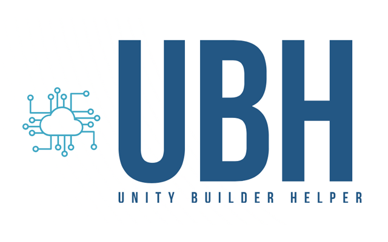

<div id="top"></div>
<!--
*** Thanks for checking out the Best-README-Template. If you have a suggestion
*** that would make this better, please fork the repo and create a pull request
*** or simply open an issue with the tag "enhancement".
*** Don't forget to give the project a star!
*** Thanks again! Now go create something AMAZING! :D
-->


<!-- PROJECT LOGO -->
<br />
<div align="center">
  <a href="https://github.com/mopsicus/unity-builder-helper">
    
  </a>

<h3 align="center">Unity Builder Helper</h3>

  <p align="center">
Unity editor tool to manage and build projects
    <br />
    <a href="https://github.com/mopsicus/unity-builder-helper/issues">Report Bug</a>
    ·
    <a href="https://github.com/mopsicus/unity-builder-helper/issues">Request Feature</a>
  </p>
</div>

<!-- TABLE OF CONTENTS -->
<details>
  <summary>Table of Contents</summary>
  <ol>
    <li>
      <a href="#about-the-project">About The Project</a>
      <ul>
        <li><a href="#features">Features</a></li>
        <li><a href="#features-with-unity-builder-bot">Features with Unity Builder Bot</a></li>
      </ul>
    </li>
    <li>
      <a href="#getting-started">Getting Started</a>
      <ul>
        <li><a href="#requirements">Requirements</a></li>
        <li><a href="#installation">Installation</a></li>
        <li><a href="#setup">Setup</a></li>
      </ul>
    </li>
    <li>
      <a href="#usage">Usage</a>
      <ul>
        <li><a href="#support-files">Support files</a></li>
      </ul>      
    </li>
    <li><a href="#roadmap">Roadmap</a></li>
    <li><a href="#contributing">Contributing</a></li>
    <li><a href="#license">License</a></li>
    <li><a href="#contact">Contact</a></li>
  </ol>
</details>


<!-- ABOUT THE PROJECT -->
## About The Project

Unity Builder Helper provide tools forh build projects, control and fast switching build targets and defines. UBH use <a href="https://github.com/mopsicus/ubb">Unity Builder Bot</a> (UBB) for remote builds.

<p align="right">(<a href="#top">back to top</a>)</p>

### Features

* Change build target
* Set defines
* Set build directory for target
* Change version and build
* Validate and set keystore
* Add locales and `*.lproj` files to iOS builds
* Add external files and frameworks to iOS builds
* Add `google-services.json` and `agconnect-services.json`
* Patch `AndroidManifest.xml`
* Patch gradle files
* Add dependencies to Huawei build
* Add external files to Android build
* Build project

### Features with Unity Builder Bot
* Update repository before build
* Build Unity project
* Build Xcode project
* Compile, archive and export to IPA with configurated manifest
* Generate HTML with install links
* Upload all objects to remote server via sshpass
* Get build logs for project
* Clear project's logs and builds

<p align="right">(<a href="#top">back to top</a>)</p>

<!-- GETTING STARTED -->
## Getting Started

Bot uses build script from Unity Builder Helper generates support files for all bot steps, but you can use your own with modifications.

### Requirements
1. Unity 2020+
2. NiceJson (in package)
3. Mac OS for building Xcode projects
4. The steady hands

### Installation

Get it from [releases page](https://github.com/mopsicus/ubh/releases) or add the line below to `Packages/manifest.json` and this module will be installed directly from git url:
```
"com.mopsicus.ubh": "https://github.com/mopsicus/ubh.git",
```

### Setup

Change settings in `UBHConfig` static class:

`string UserID` Your Telegram user ID for communicate with Unity Builder Bot

`string BotToken` Bot token

`string GameTitle` Game title for builds name

`string[] Locales` Locales list for iOS builds

`JsonObject KeyStoreGoogle` JSON object with Google keystore data: path, password, alias, alias password

`JsonObject KeyStoreHuawei` JSON object with Huawei keystore data: path, password, alias, alias password

`string[] Frameworks` Frameworks list for iOS builds

`string[] SupportFilesForiOS` List of files names for iOS builds

`Dictionary<string, string> PListForiOS` Dictionary for patch Xcode plist

`bool IsPushEnabled` Is push notifications enabled for iOS

`bool IsPurchaseEnabled` Is purchases enabled for iOS

`bool IsSignInEnabled` Is authorization with Apple enabled for iOS

<p align="right">(<a href="#top">back to top</a>)</p>


<!-- USAGE EXAMPLES -->
## Usage

1. Open UBH in Unity Editor via hotkey `cmd+g` or menu `Tools -> Unity Builder Helper`
2. Select platform, loggers and press Apply
3. Run local or remote build

### Support files

You should store your support files in project root folder "Support files". 
Structure:

```
-Project
--Support files
---Android
----drawable
----values
----...
---iOS
----Locales
-----en.lproj
-----ru.lproj
-----es.lproj
-----....
----splash.png
----splash.storyboard
----....
```

<p align="right">(<a href="#top">back to top</a>)</p>

<!-- ROADMAP -->
## Roadmap

- [ ] Add WebGL build

See the [open issues](https://github.com/mopsicus/unity-builder-helper/issues) for a full list of proposed features (and known issues).

<p align="right">(<a href="#top">back to top</a>)</p>


<!-- CONTRIBUTING -->
## Contributing

Contributions are what make the open source community such an amazing place to learn, inspire, and create. Any contributions you make are **greatly appreciated**.

If you have a suggestion that would make this better, please fork the repo and create a pull request. You can also simply open an issue with the tag "enhancement".
Don't forget to give the project a star! Thanks again!

1. Fork the Project
2. Create your Feature Branch (`git checkout -b feature/AmazingFeature`)
3. Commit your Changes (`git commit -m 'Add some AmazingFeature'`)
4. Push to the Branch (`git push origin feature/AmazingFeature`)
5. Open a Pull Request

<p align="right">(<a href="#top">back to top</a>)</p>


<!-- LICENSE -->
## License

Distributed under the MIT License. See `LICENSE` file for more information.

<p align="right">(<a href="#top">back to top</a>)</p>


<!-- CONTACT -->
## Contact

Mopsicus: mail@mopsicus.ru

Website: https://mopsicus.ru

Telegram: https://t.me/mopsicus 

Project Link: [https://github.com/mopsicus/unity-builder-helper](https://github.com/mopsicus/unity-builder-helper)

<p align="right">(<a href="#top">back to top</a>)</p>
